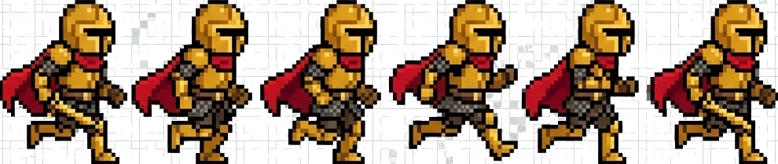

# Byte Quest: Dungeon of Binary 🎮⚔️

> A 30-hour immersive, retro-themed hackathon at **IARE, Hyderabad** featuring an interactive Phaser 3 game and comprehensive event website.



## 🌟 Features

### Interactive Game Experience
- **Phaser 3 platformer** with smooth controls and physics
- Golden Knight character with advanced movement (double jump, dash, fireball)
- Boss fight system with health bars and projectile attacks
- Mobile touch controls for seamless mobile gaming
- Retro pixel-art aesthetic with CRT effects

### Comprehensive Website
- **Responsive design** optimized for all devices
- Event information (schedule, themes, prizes, venue)
- Registration system with real-time validation
- Partner showcase and sponsorship tiers
- SEO optimized with proper meta tags

### Technical Highlights
- ⚡ **React 19** with TypeScript for type safety
- 🎨 **Tailwind CSS 4** for modern styling
- 🎬 **Framer Motion** for smooth animations
- 🎮 **Phaser 3** for game engine
- 📱 Full mobile and touch support
- ♿ Accessibility features (ARIA labels, keyboard navigation)
- 📊 Analytics integration ready

## 🚀 Quick Start

### Prerequisites
- Node.js 18+ and npm
- Git

### Installation

```bash
# Clone the repository
git clone https://github.com/Rahul-14507/qutammesh-hackathon.git
cd qutammesh-hackathon-golden

# Install dependencies
npm install

# Run development server
npm run dev

# Build for production
npm run build

# Preview production build
npm run preview
```

## 📁 Project Structure

```
src/
├── components/           # Reusable React components
│   ├── ErrorBoundary.tsx
│   ├── LoadingScreen.tsx
│   ├── OverlayModals.tsx
│   └── RegistrationForm.tsx
├── game/                 # Phaser game logic
│   ├── scenes/
│   │   └── Game.ts       # Main game scene
│   ├── objects/
│   │   └── Player.ts     # Player character class
│   ├── EventBus.ts       # React-Phaser communication
│   ├── PhaserGame.tsx    # Phaser-React wrapper
│   └── main.ts           # Game configuration
├── pages/
│   └── Website.tsx       # Main website component
├── hooks/
│   └── useMediaQuery.ts  # Responsive design hook
├── utils/
│   ├── constants.ts      # Centralized constants
│   ├── analytics.ts      # Analytics utilities
│   └── seo.ts            # SEO metadata utilities
├── App.tsx               # Root application
├── main.tsx              # Entry point
└── index.css             # Global styles
```

## 🎮 Game Controls

| Key | Action |
|-----|--------|
| A / ← | Move Left |
| D / → | Move Right |
| Space / W | Jump (press twice for double jump) |
| Shift | Dash |
| F | Fireball Attack |

### Mobile Controls
Touch buttons are automatically displayed on mobile devices for all actions.

## 🎨 Customization

### Update Event Details
Edit `/src/utils/constants.ts`:

```typescript
export const EVENT_DETAILS = {
  name: 'Your Event Name',
  date: 'Event Date',
  venue: 'Your Venue',
  // ... more details
};
```

### Styling
- Colors: Modify `/src/index.css` theme variables
- Components: Update Tailwind classes in component files
- Animations: Adjust Framer Motion configs in components

### Game Mechanics
- Player physics: `/src/game/objects/Player.ts`
- Game world: `/src/game/scenes/Game.ts`
- Enemy AI: `/src/game/scenes/Game.ts` (enemy update logic)

## 📊 Analytics Integration

The project includes analytics hooks in `/src/utils/analytics.ts`. To integrate with your analytics provider:

```typescript
// Example: Google Analytics 4
export function trackEvent({ category, action, label, value }: AnalyticsEvent) {
  if (typeof window !== 'undefined' && window.gtag) {
    window.gtag('event', action, {
      event_category: category,
      event_label: label,
      value: value,
    });
  }
}
```

## 🔧 Configuration

### Vite Configuration
Edit `vite.config.ts` for build settings, aliases, and optimizations.

### TypeScript
Strict type checking enabled. Configure in `tsconfig.json`.

### Netlify Deployment
Configuration in `netlify.toml`. Supports:
- Automatic redirects
- SPA routing
- Build optimizations

## 🌐 Deployment

### Netlify (Recommended)
```bash
npm run build
# Deploy dist/ folder to Netlify
```

### Vercel
```bash
npm run build
vercel --prod
```

### Custom Server
```bash
npm run build
# Serve dist/ folder with any static server
```

## 🎯 Event Details

- **📅 Date**: July 17-18, 2026
- **⏱️ Duration**: 30 Hours
- **📍 Venue**: IARE, Hyderabad
- **🏆 Prize Pool**: ₹60,000
- **👥 Team Size**: 1-4 members
- **💰 Registration**: ₹349 per head

## 🤝 Contributing

Contributions are welcome! Please follow these steps:

1. Fork the repository
2. Create a feature branch (`git checkout -b feature/amazing-feature`)
3. Commit your changes (`git commit -m 'Add amazing feature'`)
4. Push to the branch (`git push origin feature/amazing-feature`)
5. Open a Pull Request

## 📝 License

This project is licensed under the MIT License. See `LICENSE` for more information.

## 👥 Team

- **Devansh**: 8074237354 (Organizing Lead)
- **Ashrith**: 93909 39091 (Technical Lead)

## 🙏 Acknowledgments

- Phaser 3 community
- React and Vite teams
- Tailwind CSS contributors
- E-Cell IARE

## 📧 Contact

For queries, reach out to:
- 📧 Email: ecell@iare.ac.in
- 🌐 Website: [IARE](https://iare.ac.in)
- 📱 Devansh: 8074237354
- 📱 Ashrith: 93909 39091

---

Built with ❤️ by E-Cell IARE | © 2026 Byte Quest • All Rights Reserved
